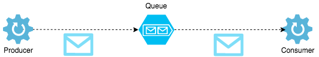

# Arquitectura de Software
## Clase 8 - Message Queuing
### Objetivos

* Implementar un producidor de datos que envíe a una cola de mensajes
* Implementar un consumidor de datos que obtenga información a partir de una cola de mensajes
* Verificar asincronismo, acoplamiento, diferencias entre publish/subscribe
* Revisar posibles aplicaciones

### Message queues

Una cola de mensajes es una forma de comunicación asíncrona de un servicio a otro servicio. Cada mensaje es almacenado en una cola hasta que son procesados y eliminados. Cada mensaje se procesa una vez sola, por un solo consumidor.
Las colas de mensajes se pueden usar para desacoplar procesos pesados, para acumular trabajo, etc.



### Ejercicio

Para implementar message queues en Node.js nos vamos a apoyar en la librería [bull](https://github.com/OptimalBits/bull) que nos permite una forma fácil y rápida de utilizar *queues*. Para esto necesitamos tener instalado [Redis](https://redis.io/).

#### Procedimiento

1. Implementar el producidor de mensajes

    ```javascript
    const Queue = require('bull');
    const queue = new Queue('queueName');
    queue.add('This is a message');
    ```

2. Implementar el consumidor desde la cola de mensajes

    ```javascript
    const Queue = require('bull');
    const queue = new Queue('queueName');

    queue.process((job, done) => {
        let message = job.data;
        console.log(`Received message: ${message}`);
    });
    ```
3. Realizar las siguientes pruebas y discutir caso a caso
	* Simular envío masivo de datos para ver el efecto en el consumidor
	* Observar comportamiento si el consumidor demora en procesar los mensajes, para esto puede apoyarse en la función *setTimeout*
	* Comente que sucede si el consumidor es detenido abruptamente
	* De manera similiar al punto anterior pero si Redis es detenido
4. Monitoreo de colas de mensajes utilizando [Arena](https://github.com/bee-queue/arena#arena)

	

5. Ahora, haga *pull* del repositorio del curso. Ejecute la aplicación [orders-api-rest](https://github.com/pablovilas/sa-course-examples/tree/master/c8/orders-api-rest) y en simultaneo ejecute el script [orders-creator-runner](https://github.com/pablovilas/sa-course-examples/tree/master/c8/orders-creator-runner) que su objetivo es crear masivamente órdenes en la API anteriormente mencionada. Comente los resultados.
6. ¿Qué sugiere para optimizar el proceso anterior?, realice los cambios necesarios.

